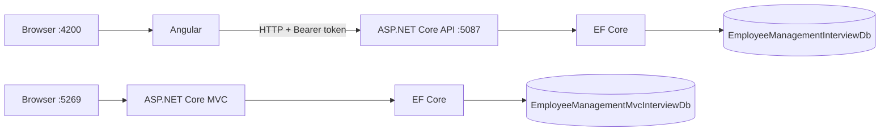

# Architecture and source map

## Two independent request flows

The diagram shows process and data boundaries. The MVC application renders Razor views on the server. Angular renders in the browser and calls the API. Neither application shares a database with the other.

## What each project owns

| Project | Entry point | Main responsibility | Data access |
| --- | --- | --- | --- |
| `sample/EmployeeManagement.Api` | `Program.cs` | JSON endpoints, JWT, CORS, Swagger | EF Core for CRUD; one stored procedure for a report |
| `sample/Frontend` | `src/main.ts` | Client routing, login, employee screens and other sample pages | `HttpClient` calls the API; no direct SQL connection |
| `sample/MvcEmployeeManagement` | `Program.cs` | Razor pages and form posts | EF Core with its own migrations |

## API source trail

| File | Use case |
| --- | --- |
| `sample/EmployeeManagement.Api/Program.cs` | Register EF Core, services, JWT, CORS, Swagger, middleware, and routes |
| `sample/EmployeeManagement.Api/Data/AppDbContext.cs` | Map tables, relationships, indexes, and seed departments and skills |
| `sample/EmployeeManagement.Api/Data/Migrations/20260927123728_InitialCreate.cs` | Create the API database and report procedure |
| `sample/EmployeeManagement.Api/Data/DatabaseInitializer.cs` | Apply migration and seed demo users in Development |
| `sample/EmployeeManagement.Api/Controllers/EmployeesController.cs` | HTTP routes and Admin-only mutations |
| `sample/EmployeeManagement.Api/DTOs/EmployeeDtos.cs` | Request validation, query inputs, and response shape |
| `sample/EmployeeManagement.Api/Services/EmployeeService.cs` | Filtering, sorting, paging, CRUD, and reference checks |
| `sample/EmployeeManagement.Api/Middleware/ExceptionHandlingMiddleware.cs` | Convert thrown exceptions to HTTP problem responses |

## Angular source trail

| File | Use case |
| --- | --- |
| `sample/Frontend/src/environments/environment.ts` | Base API URL |
| `sample/Frontend/src/app/app.routes.ts` | Lazy routes and route guards |
| `sample/Frontend/src/app/core/services/auth.service.ts` | Login, local session, role checks |
| `sample/Frontend/src/app/core/interceptors/auth.interceptor.ts` | Add Bearer token; clear session on 401 |
| `sample/Frontend/src/app/core/services/employee.service.ts` | Employee API calls and query parameters |
| `sample/Frontend/src/app/features/employees/employee-list/employee-list.component.ts` | Filters, sort, pagination, delete flow |
| `sample/Frontend/src/app/features/employees/employee-form/employee-form.component.ts` | Validated create/edit form and optional image upload |

## MVC source trail

| File | Use case |
| --- | --- |
| `sample/MvcEmployeeManagement/Program.cs` | Register MVC and EF Core, configure routes, migrate in Development |
| `sample/MvcEmployeeManagement/Data/AppDbContext.cs` | Employee/department mapping and department seed |
| `sample/MvcEmployeeManagement/ViewModels/EmployeeFormViewModel.cs` | Form fields and server validation |
| `sample/MvcEmployeeManagement/ViewModels/EmployeeListViewModel.cs` | List filters and result metadata |
| `sample/MvcEmployeeManagement/Controllers/EmployeesController.cs` | GET/POST actions, queries, validation, redirects |
| `sample/MvcEmployeeManagement/Views/Employees/` | List, Create, Edit, Details, Delete, shared form partial |

## Read the complete source here

The [source pages](/source/) print every first-party coding and configuration file in full, including migrations and Angular templates. The [source bundle](/sample-source.zip) includes dependency lockfiles and binary/vendor assets. SQL Server, .NET, and Node.js must still be installed separately.
