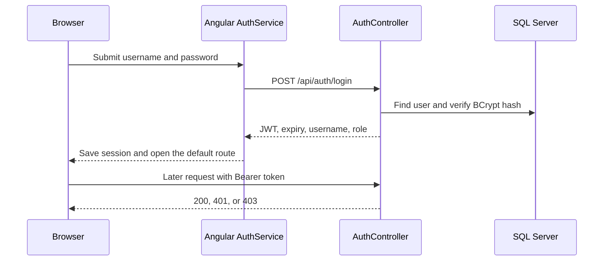

# Authentication and access

The API uses JWT Bearer authentication. Local demo users are seeded when the API starts in Development. A new registration is always assigned the `Viewer` role by `AuthService`; the request does not choose its role.

## Login to request



`sample/EmployeeManagement.Api/Services/AuthService.cs` normalizes usernames, verifies BCrypt hashes, and issues a one-hour token with a role claim. `sample/EmployeeManagement.Api/Program.cs` configures JWT validation for issuer, audience, lifetime, and signing key.

**File: `sample/EmployeeManagement.Api/Controllers/EmployeesController.cs`. Purpose: require a signed-in user for reads and Admin for writes.**

```csharp
[Authorize(Roles = "Admin")]
[HttpPost]
public async Task<ActionResult<EmployeeDto>> CreateEmployee(EmployeeRequest request)
{
    var employee = await employeeService.CreateEmployeeAsync(request);
    return CreatedAtAction(nameof(GetEmployee), new { employeeId = employee.EmployeeId }, employee);
}
```

The controller also has `[Authorize]` at class level, so all its actions require a signed-in user. The action above adds the Admin requirement for employee creation.

## Client behavior

| File | Responsibility |
| --- | --- |
| `sample/Frontend/src/app/core/services/auth.service.ts` | Calls login/register, stores the response in `localStorage`, checks expiry and role |
| `sample/Frontend/src/app/core/guards/auth.guard.ts` | Redirects an unauthenticated visitor to `/login` |
| `sample/Frontend/src/app/core/guards/admin.guard.ts` | Redirects a non-Admin visitor away from create/edit routes |
| `sample/Frontend/src/app/core/interceptors/auth.interceptor.ts` | Adds `Authorization: Bearer ...` and logs out on API 401 |
| `sample/Frontend/src/app/app.routes.ts` | Assigns guards to employee routes and the default landing page |

**File: `sample/Frontend/src/app/core/interceptors/auth.interceptor.ts`. Purpose: attach the current token to outgoing HTTP requests.**

```typescript
const token = authService.accessToken;
const authorizedRequest = token
  ? request.clone({ setHeaders: { Authorization: `Bearer ${token}` } })
  : request;
```

The browser route guard improves navigation but does not secure data. The server's `[Authorize]` and role attributes decide whether an API call succeeds. A missing or expired token leads to 401; a valid Viewer token on an Admin-only action leads to 403.

## Local security boundary

This is an interview demo. The development configuration has known accounts and a development signing key. The Angular app stores the login response in `localStorage`. Before adapting it for a real system, review credential management, token storage, authorization coverage, file upload handling, and deployment settings. This guide does not treat the demo accounts as deployable credentials.
