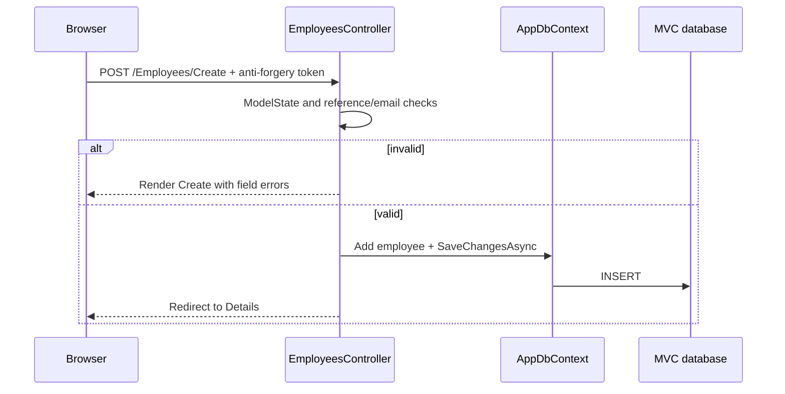

# Standalone MVC: Razor CRUD flow

The MVC project renders HTML on the server. Its browser forms post back to the same application, and the controller queries its own SQL Server database. It does not use the Angular client, the API, or JWT.

## Pages

| URL | Action |
| --- | --- |
| `/Employees` | Filter, sort, and page employees |
| `/Employees/Create` | Add an employee |
| `/Employees/Details/{id}` | View one employee |
| `/Employees/Edit/{id}` | Update an employee |
| `/Employees/Delete/{id}` | Confirm and delete |

`sample/MvcEmployeeManagement/Views/Employees/_EmployeeForm.cshtml` is shared by Create and Edit. `EmployeeFormViewModel` owns form validation and the department dropdown. `EmployeeListViewModel` carries list filters, results, and pagination metadata.

## Follow a Create form post



`sample/MvcEmployeeManagement/Controllers/EmployeesController.cs` uses `[AutoValidateAntiforgeryToken]`. The POST Create action checks `ModelState`, verifies the department exists, checks normalized email uniqueness, and handles a SQL unique-index race. Invalid forms re-render with department options. Successful writes use a redirect, avoiding form resubmission on refresh.

**File: `sample/MvcEmployeeManagement/Controllers/EmployeesController.cs`. Purpose: validate and persist a new employee from a Razor form.**

```csharp
if (ModelState.IsValid)
    await ValidateReferencesAndEmailAsync(model, null);
if (!ModelState.IsValid)
{
    model.Departments = await GetDepartmentOptionsAsync();
    return View(model);
}

var employee = new Employee();
CopyFormToEmployee(model, employee);
dbContext.Employees.Add(employee);
```

The full action also saves, catches duplicate-email database errors, sets a success message, and redirects to Details.

## The list query

The Index action applies search and department filtering, counts matches, chooses an allowed sort, then uses `Skip` and `Take` with a fixed page size of 10. `AsNoTracking` avoids tracking rows used only for display. The query includes the department name for the Razor list.

**File: `sample/MvcEmployeeManagement/Controllers/EmployeesController.cs`. Purpose: load one page after filtering and sorting.**

```csharp
Employees = await employees.Skip((page - 1) * pageSize)
    .Take(pageSize).ToListAsync(),
```

The database is defined by `sample/MvcEmployeeManagement/Data/AppDbContext.cs` and its migration under `Data/Migrations/`. Development startup applies that migration. There are four seeded departments and no seeded employees.

## Debug in Visual Studio

Open `sample/MvcEmployeeManagement/EmployeeManagement.Mvc.sln`, use the `http` profile, and put breakpoints in the GET Create action, POST Create action, `ValidateReferencesAndEmailAsync`, and `SaveChangesAsync`. Submit the form and inspect `ModelState`, the view model, and the entity. Use browser Network tools to inspect status and redirect.

The MVC project intentionally has no login or role protection. Keep this exercise on a local development machine.
